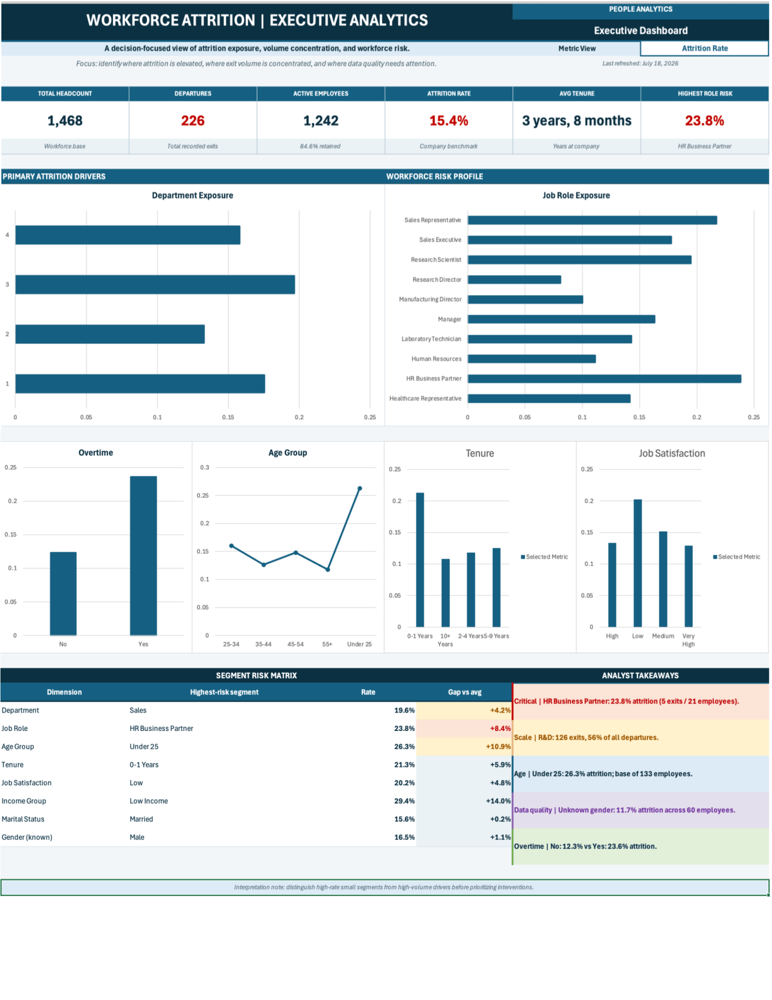

# 📊 HR Attrition Analytics Dashboard

> An end-to-end HR analytics project built in Microsoft Excel to analyze employee attrition, identify workforce trends, and support data-driven HR decision-making.

---

# Dashboard Preview

> *(A dashboard screenshot will be displayed here after uploading the image.)*



---

# Project Overview

Employee attrition is one of the most significant challenges faced by organizations. High turnover increases recruitment costs, reduces productivity, and negatively impacts organizational performance.

This project analyzes employee attrition data to uncover workforce patterns, identify high-risk groups, and provide actionable business recommendations through an interactive Excel dashboard.

The project follows a complete analytics workflow—from raw data preparation to executive reporting.

---

# Business Problem

The HR department needs to understand:

- Why employees leave
- Which departments have the highest attrition
- Which employee groups are at the highest risk
- How demographic and job-related factors influence employee turnover

The objective is to transform raw HR data into meaningful business insights that support strategic workforce planning.

---

# Project Objectives

- Analyze employee attrition trends
- Monitor workforce demographics
- Identify high-risk employee segments
- Support HR decision-making
- Create an interactive executive dashboard
- Demonstrate an end-to-end analytics workflow

---

# Dashboard Features

The dashboard includes:

- Executive KPI cards
- Attrition analysis
- Department comparison
- Job role analysis
- Gender distribution
- Age distribution
- Education analysis
- Business travel analysis
- Interactive slicers
- Dynamic charts

---

# Key Performance Indicators (KPIs)

- Total Employees
- Active Employees
- Attrition Count
- Attrition Rate
- Average Age
- Average Monthly Income
- Average Years at Company

---

# Business Questions Answered

- Which department experiences the highest attrition?
- Which job roles have the greatest employee turnover?
- Does business travel affect attrition?
- Which age groups leave the company most frequently?
- Does education level influence employee retention?
- Which gender has the highest attrition rate?
- What workforce characteristics are associated with employee turnover?

---

# Dataset Overview

Dataset contains fictional employee records including:

- Employee demographics
- Department
- Job role
- Education
- Marital status
- Monthly income
- Business travel
- Overtime
- Years at company
- Attrition status

The project contains both:

- Raw dataset
- Cleaned dataset

---

# Project Workflow

```text
Business Requirements
        │
        ▼
Raw Dataset
        │
        ▼
Data Cleaning
        │
        ▼
Data Validation
        │
        ▼
Feature Engineering
        │
        ▼
Pivot Tables
        │
        ▼
Dashboard Design
        │
        ▼
Business Analysis
        │
        ▼
Executive Report
```

---

# Tools & Technologies

- Microsoft Excel
- Pivot Tables
- Pivot Charts
- Slicers
- Data Validation
- Conditional Formatting
- Lookup Functions
- Data Cleaning Techniques
- Dashboard Design
- Business Analytics

---

# Repository Structure

```text
hr-attrition-analytics-dashboard/

dashboard/
dataset/
documentation/
reports/
workbook/

README.md
```

---

# Project Documentation

The repository includes professional project documentation:

- Business Requirements
- Data Dictionary
- Project Methodology
- Portfolio Case Study
- Executive Report

---

# Key Business Insights

Examples of insights generated:

- Departments with the highest attrition
- Workforce demographic trends
- Income distribution analysis
- Employee retention patterns
- Attrition by education level
- Attrition by job role
- Business travel impact on employee turnover

---

# Business Recommendations

Examples of strategic recommendations:

- Improve retention strategies for high-risk departments
- Review compensation for vulnerable employee groups
- Strengthen employee engagement initiatives
- Develop targeted career progression programs
- Improve onboarding and mentoring processes

---

# Skills Demonstrated

✔ Data Cleaning

✔ Data Validation

✔ Data Analysis

✔ Business Analysis

✔ Dashboard Design

✔ KPI Development

✔ Data Visualization

✔ Excel Reporting

✔ Executive Communication

✔ Business Documentation

---

# Future Improvements

Potential enhancements include:

- Power BI version
- SQL database integration
- Automated Excel refresh
- Python analytics workflow
- Predictive attrition modeling
- Machine learning implementation

---

# About the Author

**Amirreza Akbari**

Aspiring Data Analyst specializing in Business Analytics, HR Analytics, and Financial Data Analytics.

GitHub:
https://github.com/amirzakbri

LinkedIn:
https://Linkedin.com/in/amirzakbri

---

# License

This project is intended for educational and portfolio purposes.